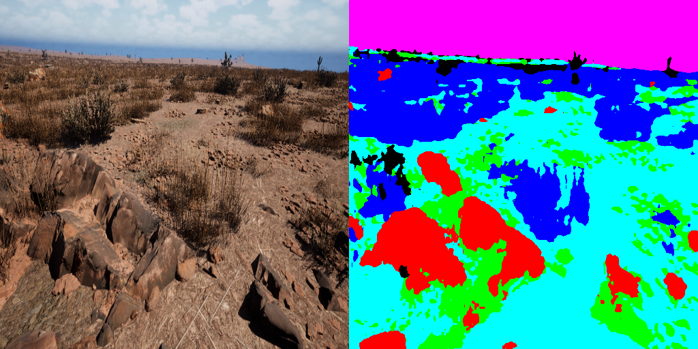
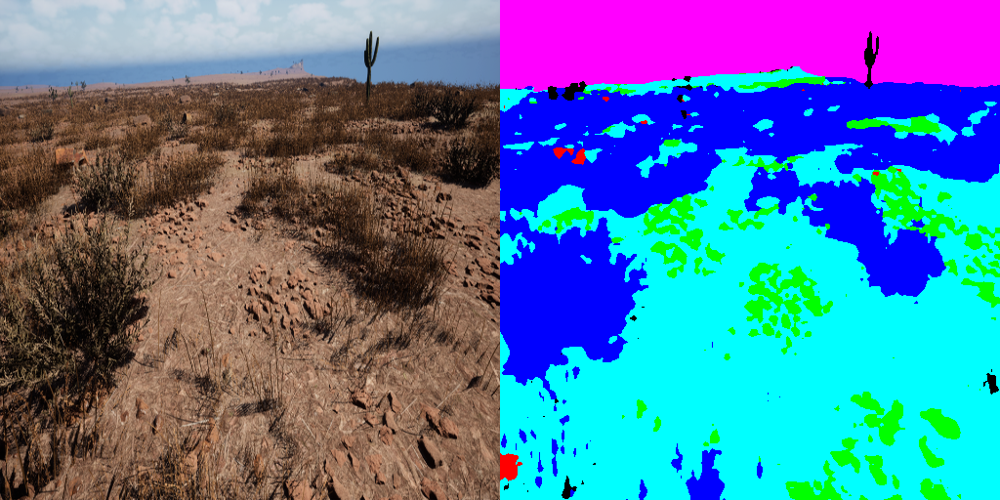
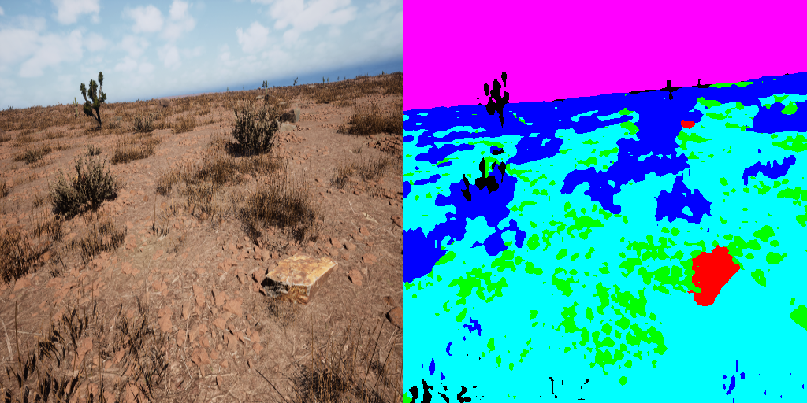
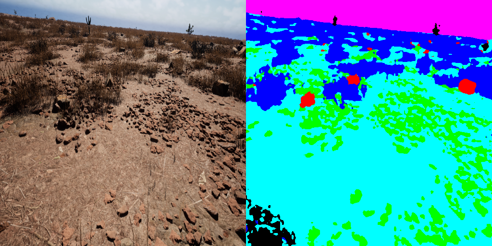
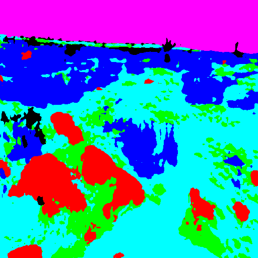
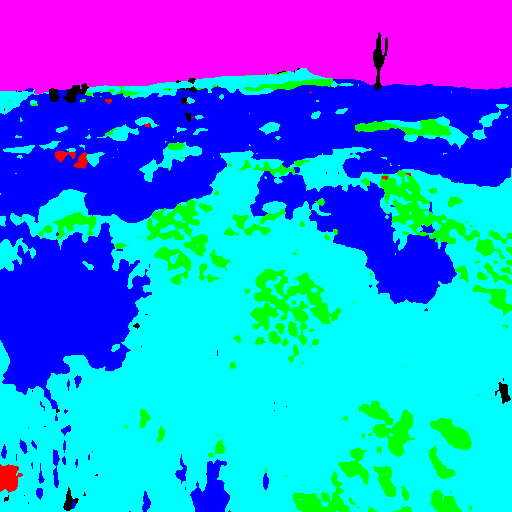
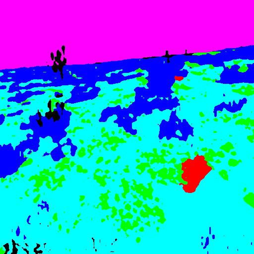
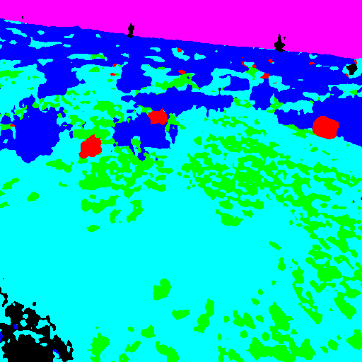

# 🏜️ Desert Terrain Semantic Segmentation

[](https://python.org)
[](https://pytorch.org)

A deep learning solution for **semantic segmentation of desert/off-road terrain** images using DeepLabV3+ architecture with ResNet-50 encoder. This project was developed for the **Duality AI Falcon Hackathon - Segmentation Challenge**.

---

## 📋 Table of Contents

- [Overview](#-overview)
- [Dataset](#-dataset)
- [Model Architecture](#-model-architecture)
- [Project Structure](#-project-structure)
- [Installation](#-installation)
- [Usage](#-usage)
- [Results](#-results)
- [Configuration](#-configuration)
- [Technical Details](#-technical-details)
- [Acknowledgments](#-acknowledgments)

---

## 🎯 Overview

This project addresses the challenge of **semantic segmentation in desert/off-road environments**. The goal is to accurately classify each pixel in an image into one of **6 terrain classes**, enabling autonomous vehicles and robots to understand and navigate challenging desert landscapes.

### Key Features

- 🏗️ **DeepLabV3+ Architecture** with ResNet-50 backbone pretrained on ImageNet
- 📊 **6-Class Segmentation** for diverse terrain types
- 🔄 **Data Augmentation** including horizontal flips and color jittering
- 📈 **Mean IoU Metric** for performance evaluation
- 🎨 **Colored Visualizations** for easy interpretation of results

---

## 📁 Dataset

**Source:** [Duality AI Falcon Hackathon - Segmentation Desert Challenge](https://falcon.duality.ai/secure/documentation/hackathon-segmentation-desert)

### Dataset Statistics

| Split          | Images | Description                               |
| -------------- | ------ | ----------------------------------------- |
| **Train**      | ~3,300 | Training images with ground truth masks   |
| **Validation** | ~300   | Validation images with ground truth masks |
| **Test**       | ~1,000 | Test images for final evaluation          |

### Class Labels

The dataset contains **6 semantic classes** representing different terrain types. Original mask labels were non-contiguous and have been remapped to a contiguous class index space:

| Class ID | Original Label | Description          |
| -------- | -------------- | -------------------- |
| 0        | 0              | Background / Class 0 |
| 1        | 1              | Terrain Type 1       |
| 2        | 2              | Terrain Type 2       |
| 3        | 3              | Terrain Type 3       |
| 4        | 27             | Terrain Type 4       |
| 5        | 39             | Terrain Type 5       |

### Color Mapping (Visualization)

| Class | Color   | RGB           |
| ----- | ------- | ------------- |
| 0     | Black   | (0, 0, 0)     |
| 1     | Red     | (255, 0, 0)   |
| 2     | Green   | (0, 255, 0)   |
| 3     | Blue    | (0, 0, 255)   |
| 4     | Yellow  | (255, 255, 0) |
| 5     | Magenta | (255, 0, 255) |

### Rule Compliance

- ✅ Training and tuning performed **only** on train/validation sets
- ✅ Unseen test set used **strictly** for inference
- ✅ Test labels were **not used** at any stage

---

## 🏗️ Model Architecture

### DeepLabV3+ with ResNet-50

```
┌─────────────────────────────────────────────────────────────┐
│                    Input Image (512x512)                     │
├─────────────────────────────────────────────────────────────┤
│                                                              │
│  ┌─────────────────────────────────────────────────────┐    │
│  │              ResNet-50 Encoder                       │    │
│  │           (ImageNet Pretrained)                      │    │
│  └─────────────────────────────────────────────────────┘    │
│                          │                                   │
│                          ▼                                   │
│  ┌─────────────────────────────────────────────────────┐    │
│  │         Atrous Spatial Pyramid Pooling (ASPP)       │    │
│  │    (Multi-scale context aggregation)                │    │
│  └─────────────────────────────────────────────────────┘    │
│                          │                                   │
│                          ▼                                   │
│  ┌─────────────────────────────────────────────────────┐    │
│  │              DeepLabV3+ Decoder                      │    │
│  │     (Feature fusion & upsampling)                    │    │
│  └─────────────────────────────────────────────────────┘    │
│                          │                                   │
│                          ▼                                   │
│              Output: 6-Channel Segmentation Map              │
│                      (512x512x6)                             │
└─────────────────────────────────────────────────────────────┘
```

**Why DeepLabV3+?**

- Excellent multi-scale feature extraction via ASPP
- Strong encoder-decoder structure for precise boundaries
- Proven performance on semantic segmentation tasks
- Efficient inference with good accuracy tradeoff

---

## 📂 Project Structure

```
payload-igdtuw/
├── 📄 README.md                 # This file
├── 📄 requirements.txt          # Python dependencies
├── 📄 script.py                 # Utility script
│
├── 📁 configs/
│   └── baseline.yaml            # Training configuration
│
├── 📁 data/
│   ├── train/
│   │   ├── images/              # ~3,300 training images
│   │   └── masks/               # Ground truth masks
│   ├── val/
│   │   ├── images/              # ~300 validation images
│   │   └── masks/               # Ground truth masks
│   └── test/
│       ├── images/              # ~1,000 test images
│       └── DO_NOT_USE/          # Reserved
│
├── 📁 models/
│   └── deeplabv3plus_resnet50.pth  # Trained model weights
│
├── 📁 results/
│   ├── masks/                   # Predicted segmentation masks (not tracked)
│   └── visuals/                 # Side-by-side visualizations (not tracked)
│
├── 📁 assets/
│   └── results/
│       ├── masks/               # 4 sample masks committed for README
│       └── visuals/             # 4 sample visuals committed for README
│
└── 📁 src/
    ├── dataset.py               # Dataset class & augmentations
    ├── model.py                 # Model architecture
    ├── train.py                 # Training pipeline
    ├── eval.py                  # Inference & visualization
    └── metrics.py               # Evaluation metrics (mIoU)
```

---

## 🛠️ Installation

### Prerequisites

- Python 3.8+
- CUDA-compatible GPU (recommended)
- ~8GB GPU memory for training

### Setup

1. **Clone the repository**

   ```bash
   git clone <repository-url>
   cd payload-igdtuw
   ```

2. **Create virtual environment (recommended)**

   ```bash
   python -m venv venv
   source venv/bin/activate  # Linux/Mac
   # or
   .\venv\Scripts\activate   # Windows
   ```

3. **Install dependencies**
   ```bash
   pip install -r requirements.txt
   ```

### Dependencies

```
torch
torchvision
torchaudio
segmentation-models-pytorch
albumentations
opencv-python
numpy
matplotlib
tqdm
pyyaml
```

---

## 🚀 Usage

### Training

Train the model from scratch:

```bash
python src/train.py
```

The training script will:

- Load configuration from `configs/baseline.yaml`
- Train for 20 epochs with AdamW optimizer
- Save the best model based on validation mIoU
- Output training loss and validation mIoU per epoch

### Inference

Generate predictions on test images:

```bash
python src/eval.py
```

This will:

- Load the trained model from `models/deeplabv3plus_resnet50.pth`
- Run inference on all test images
- Save colored masks to `results/masks/`
- Save side-by-side visualizations to `results/visuals/`
- (Optional) Move selected samples to `assets/results/` for GitHub

---

## 📊 Results

### Sample Predictions

Below are sample results showing the model's segmentation performance on test images. Each visualization shows the **original image** (left) alongside the **predicted segmentation mask** (right).

#### Sample 1



#### Sample 2



#### Sample 3



#### Sample 4



### Segmentation Masks Only

| Mask 1                                      | Mask 2                                      | Mask 3                                      | Mask 4                                      |
| ------------------------------------------- | ------------------------------------------- | ------------------------------------------- | ------------------------------------------- |
|  |  |  |  |

### Legend

| Color      | Class Description |
| ---------- | ----------------- |
| ⬛ Black   | Class 0           |
| 🟥 Red     | Class 1           |
| 🟩 Green   | Class 2           |
| 🟦 Blue    | Class 3           |
| 🟨 Yellow  | Class 4           |
| 🟪 Magenta | Class 5           |

---

## ⚙️ Configuration

Training parameters are defined in `configs/baseline.yaml`:

```yaml
seed: 42 # Random seed for reproducibility

image_size: 512 # Input image resolution
num_classes: 6 # Number of segmentation classes

batch_size: 4 # Training batch size
epochs: 20 # Number of training epochs
learning_rate: 0.0001 # AdamW learning rate

device: cuda # Training device (cuda/cpu)
```

### Customizing Training

Modify `configs/baseline.yaml` to experiment with:

- **Image size**: Higher resolution may improve accuracy
- **Batch size**: Adjust based on GPU memory
- **Learning rate**: Fine-tune for convergence
- **Epochs**: Increase for potentially better results

---

## 🔧 Technical Details

### Data Preprocessing

1. **Resizing**: All images resized to 512×512
2. **Normalization**: Pixel values scaled to [0, 1]
3. **Label Remapping**: Original labels → sequential 0-5

### Data Augmentation (Training Only)

- **Horizontal Flip**: p=0.5
- **Color Jitter**: p=0.3

### Training Details

| Parameter     | Value            |
| ------------- | ---------------- |
| Optimizer     | AdamW            |
| Loss Function | CrossEntropyLoss |
| Learning Rate | 1e-4             |
| Batch Size    | 4                |
| Input Size    | 512×512          |
| Epochs        | 20               |

### Evaluation Metric

**Mean Intersection over Union (mIoU)**

$$mIoU = \frac{1}{C} \sum_{c=1}^{C} \frac{TP_c}{TP_c + FP_c + FN_c}$$

Where:

- $C$ = number of classes (6)
- $TP_c$ = true positives for class $c$
- $FP_c$ = false positives for class $c$
- $FN_c$ = false negatives for class $c$

---

## 🔄 Reproducing Results

To reproduce the results:

1. **Download the dataset** from [Duality AI Falcon](https://falcon.duality.ai/secure/documentation/hackathon-segmentation-desert)

2. **Organize the data** according to the project structure:

   ```
   data/
   ├── train/images/ & masks/
   ├── val/images/ & masks/
   └── test/images/
   ```

3. **Train the model**:

   ```bash
   python src/train.py
   ```

4. **Run inference**:

   ```bash
   python src/eval.py
   ```

5. **View results** locally in `results/visuals/` and `results/masks/` (not pushed). The four samples shown in this README live in `assets/results/`.

---

## 📝 Future Improvements

- [ ] Experiment with different encoders (EfficientNet, ResNeXt)
- [ ] Add more data augmentations (rotation, scaling, elastic transform)
- [ ] Implement learning rate scheduling
- [ ] Try different loss functions (Dice Loss, Focal Loss)
- [ ] Add test-time augmentation (TTA)
- [ ] Ensemble multiple models

---

## 🙏 Acknowledgments

- **Duality AI** for providing the dataset
- **Segmentation Models PyTorch** library for the DeepLabV3+ implementation
- **Albumentations** for efficient data augmentation
- **PyTorch** team for the deep learning framework

---
